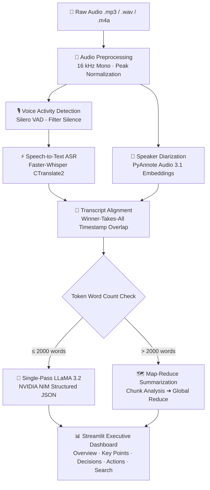

<div align="center">

# 🎙️ Meeting Intelligence System

### Turn Raw Multi-Speaker Audio into Structured Meeting Intelligence

[](https://www.python.org/)
[](https://github.com/SYSTRAN/faster-whisper)
[](https://github.com/pyannote/pyannote-audio)
[-76B900.svg?logo=nvidia&logoColor=white)](https://build.nvidia.com)
[](https://streamlit.io/)
[](LICENSE)

<br/>

> 🎙️ **An intelligent meeting intelligence system powered by OpenAI Whisper, PyAnnote Audio, NVIDIA NIM (Llama 3.2), and Streamlit. Transforms raw multi-speaker audio recordings into structured, timestamped transcripts with speaker diarization, executive summaries, decisions, and actionable task assignments. 🚀**

</div>

---

## 📌 Overview

Meetings are time-consuming, expensive, and critical context is frequently lost in informal notes. **Meeting Intelligence System** is an end-to-end speech and NLP pipeline that ingests raw multi-speaker audio files and automatically generates:

- 🕒 **Word & Segment Timestamped Transcripts**
- 👥 **Speaker Diarization** (*who spoke when*)
- 📝 **Executive Summary & Topic Breakdown**
- 💡 **Key Discussion Points** (with intelligent fallback parsers)
- ✅ **Decisions Made** with verbatim context quotes & timestamps
- 📌 **Action Items & Task Ownership** with confidence scores and deadlines
- 🔍 **Interactive Transcript Search** and multi-format exports (JSON, TXT, Markdown)

---

## 🏗️ Architecture & Pipeline Flow



---

## ✨ Key Features

| Capability | Technology | Description |
|:---|:---|:---|
| **High-Performance ASR** | `faster-whisper` | 2–4× faster than standard Whisper via CTranslate2 with int8 quantization support. |
| **Voice Activity Detection** | `silero-vad` | Ultra-fast neural VAD removes non-speech frames and trims processing latency. |
| **Speaker Diarization** | `pyannote.audio` | State-of-the-art speaker clustering that attributes segments to individual voices. |
| **Transcript Alignment** | Custom Algorithm | Maps ASR segment intervals against speaker timelines using maximum overlap matching. |
| **LLM Insights Extraction** | `Llama 3.2` via NVIDIA NIM | Extracts JSON schemas containing summaries, key points, decisions, and action items. |
| **Map-Reduce for Long Audio** | Hierarchical LLM Calls | Splits long transcripts (>15+ min) into chunks before reducing into unified insights. |
| **Defensive Fallback Parsers** | Regex & Heuristic Recovery | Guarantees non-empty key points and structured outputs even with constrained models. |
| **Interactive UI** | `Streamlit` | Modern dark-mode dashboard with search, player, metrics, and one-click exports. |

---

## 🛠️ Tech Stack

- **Speech Recognition (ASR):** [Faster-Whisper](https://github.com/SYSTRAN/faster-whisper) (Whisper Tiny, Base, Small, Medium, Large-v3)
- **Speaker Diarization:** [PyAnnote Audio 3.1](https://github.com/pyannote/pyannote-audio)
- **Voice Activity Detection (VAD):** [Silero VAD](https://github.com/snakers4/silero-vad)
- **Large Language Model (LLM):** Meta LLaMA 3.2 (11B / 90B) via [NVIDIA NIM](https://build.nvidia.com) (with OpenAI GPT-4o-mini fallback)
- **Audio Engineering:** Librosa, SoundFile, PyDub, FFmpeg
- **Data Modeling & Validation:** Pydantic v2
- **Frontend Dashboard:** Streamlit & Plotly
- **Evaluation & Benchmarking:** JiWER (Word Error Rate), RTF (Real-Time Factor)

---

## ⚡ Quickstart & Installation

### 1. Clone the Repository
```bash
git clone https://github.com/yourusername/meeting-intelligence.git
cd meeting-intelligence
```

### 2. Set Up Virtual Environment
```powershell
# Windows (PowerShell)
python -m venv venv
.\venv\Scripts\Activate.ps1

# Linux / macOS
python3 -m venv venv
source venv/bin/activate
```

### 3. Install PyTorch & Dependencies

**CPU Mode (Default / Laptop):**
```bash
pip install torch --index-url https://download.pytorch.org/whl/cpu
pip install -r requirements.txt
```

**GPU Mode (NVIDIA CUDA):**
```bash
pip install torch --index-url https://download.pytorch.org/whl/cu118
pip install -r requirements.txt
```

### 4. Install FFmpeg
- **Windows:** Download from [gyan.dev/ffmpeg](https://www.gyan.dev/ffmpeg/builds/) or install via `winget install Gyan.FFmpeg`
- **macOS:** `brew install ffmpeg`
- **Ubuntu/Debian:** `sudo apt install ffmpeg`

---

## 🔑 Environment Configuration

Create a `.env` file in the project root based on [`.env.example`](.env.example):

```env
# ── NVIDIA NIM (Primary LLM - Free API Key from build.nvidia.com) ─────────────
NVIDIA_API_KEY=nvapi-your_key_here
NVIDIA_BASE_URL=https://integrate.api.nvidia.com/v1
OPENAI_MODEL=meta/llama-3.2-11b-vision-instruct

# ── Optional Fallbacks ────────────────────────────────────────────────────────
OPENAI_API_KEY=your_openai_key_here

# ── Speaker Diarization (Required for PyAnnote) ────────────────────────────────
# 1. Accept user conditions at: https://hf.co/pyannote/speaker-diarization-3.1
# 2. Accept user conditions at: https://hf.co/pyannote/segmentation-3.0
# 3. Create access token at: https://hf.co/settings/tokens
HUGGINGFACE_TOKEN=hf_your_token_here

# ── Whisper & Pipeline Defaults ───────────────────────────────────────────────
WHISPER_MODEL_SIZE=base
WHISPER_DEVICE=cpu
WHISPER_COMPUTE_TYPE=int8
OUTPUT_DIR=data/outputs
```

---

## 🚀 Running the Application

### 🖥️ Interactive Web Dashboard (Recommended)

Run Streamlit using the virtual environment:

```powershell
.\venv\Scripts\python.exe -m streamlit run app/app.py
```
Open your browser at **`http://localhost:8501`**.

#### Dashboard Features:
- 📤 **Audio Upload:** Drag & drop MP3, WAV, M4A, or FLAC recordings.
- 🎛️ **Sidebar Controls:** Select Whisper model size, target language, VAD toggle, diarization toggle, and LLM selection.
- 📋 **Overview Tab:** High-level executive summary, detected participant pills, and agenda topics.
- 💡 **Key Points Tab:** Bullet-point breakdown of core discussion topics.
- ✅ **Decisions Tab:** Documented decisions accompanied by verbatim quotes and timestamps.
- 📌 **Action Items Tab:** Structured task table with owners, deadlines, and confidence scores.
- 🔍 **Search Tab:** Real-time keyword filter across full transcript segments.
- 💾 **Export:** Instant download as JSON, Markdown, or clean TXT.

---

### 💻 Command Line Interface (CLI)

You can also run batch processing directly through `main.py`:

```bash
# Basic transcription & analysis
python main.py data/meeting.mp3

# Specify model and language
python main.py data/meeting.wav --language en --model small

# Skip diarization (Fast mode without HuggingFace token)
python main.py data/meeting.mp3 --no-diarization

# CLI Options & Help
python main.py --help
```

---

## 📊 Benchmarks & Performance

### Real-Time Factor (RTF)
$\text{RTF} = \frac{\text{Processing Time (s)}}{\text{Audio Duration (s)}}$  
*(Values below 1.0 indicate faster-than-real-time execution)*

| Hardware | Whisper Model | VAD Enabled | Diarization | RTF | 10-Min Audio Process Time |
|:---|:---:|:---:|:---:|:---:|:---:|
| **Modern Laptop (CPU - i7)** | `base` | ✅ | ❌ | **~0.21x** | **~2 mins** |
| **Modern Laptop (CPU - i7)** | `small` | ✅ | ❌ | **~0.65x** | **~6.5 mins** |
| **NVIDIA RTX GPU (CUDA)** | `base` | ✅ | ✅ | **~0.06x** | **~35 secs** |
| **NVIDIA RTX GPU (CUDA)** | `large-v3` | ✅ | ✅ | **~0.15x** | **~1.5 mins** |

---

## 📁 Repository Structure

```
meeting-intelligence/
├── app/
│   └── app.py                     # Streamlit web dashboard
├── src/
│   ├── audio/
│   │   ├── preprocessing.py       # 16kHz mono resampling & normalization
│   │   ├── vad.py                 # Silero Voice Activity Detection
│   │   └── metadata.py            # Audio validation & duration extraction
│   ├── transcription/
│   │   ├── asr.py                 # Faster-Whisper inference engine
│   │   └── timestamps.py          # Segment formatting & cleaning
│   ├── diarization/
│   │   └── speaker_diarization.py # PyAnnote 3.1 speaker clustering
│   ├── meeting/
│   │   ├── summarizer.py          # LLaMA 3.2 / NVIDIA NIM map-reduce & fallback parser
│   │   └── export.py              # Multi-format exports (JSON, TXT, MD)
│   ├── pipeline.py                # End-to-end pipeline orchestrator & alignment
│   ├── models.py                  # Pydantic data schemas & contracts
│   ├── config.py                  # Environment settings manager
│   └── utils.py                   # Timing & formatting utilities
├── evaluation/
│   ├── wer.py                     # Word Error Rate benchmark (JiWER)
│   └── latency.py                 # RTF & latency profiling
├── tests/                         # Unit tests (pytest)
├── requirements.txt               # Project dependencies
├── .env.example                   # Environment configuration template
└── README.md
```

---

## 🛡️ Reliability & Edge Case Handling

- **Graceful Degradation:** If PyAnnote fails or no Hugging Face token is provided, the pipeline smoothly continues with full transcription and LLM analysis without crashing.
- **Defensive LLM Parsing:** If an LLM returns commentary or omits the `key_points` list, [`extract_fallback_key_points()`](src/meeting/summarizer.py) recovers the discussion points directly from the summary.
- **Map-Reduce Splitting:** Transcripts exceeding token context limits are automatically chunked, summarized in parallel, and consolidated without context truncation.

---

## 📄 License

This project is licensed under the [MIT License](LICENSE).
